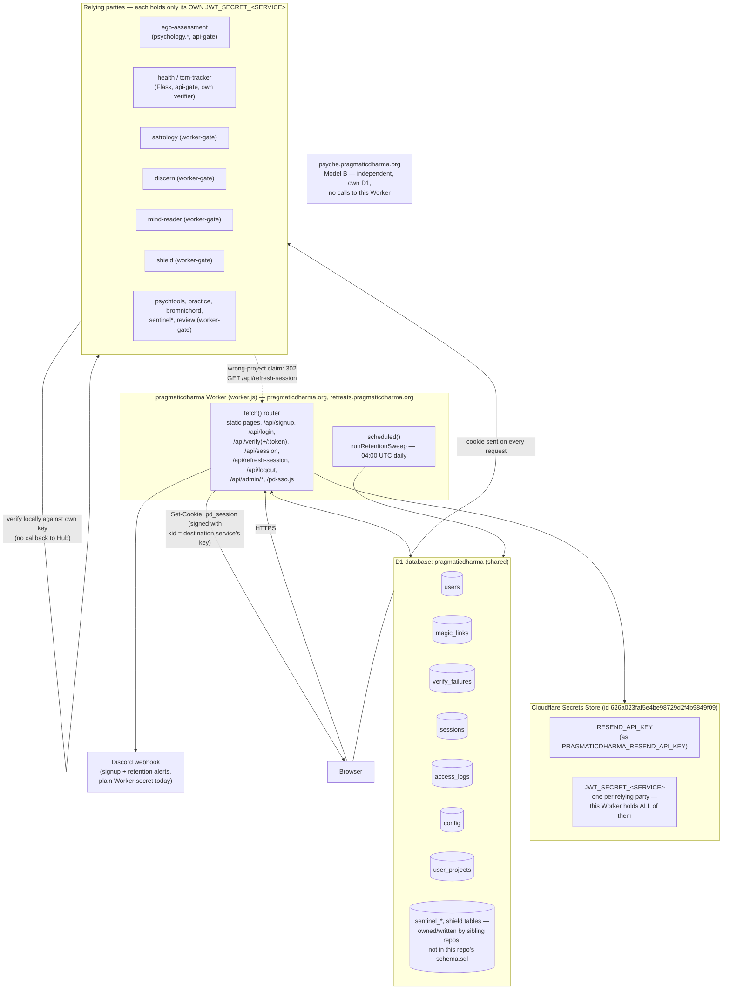
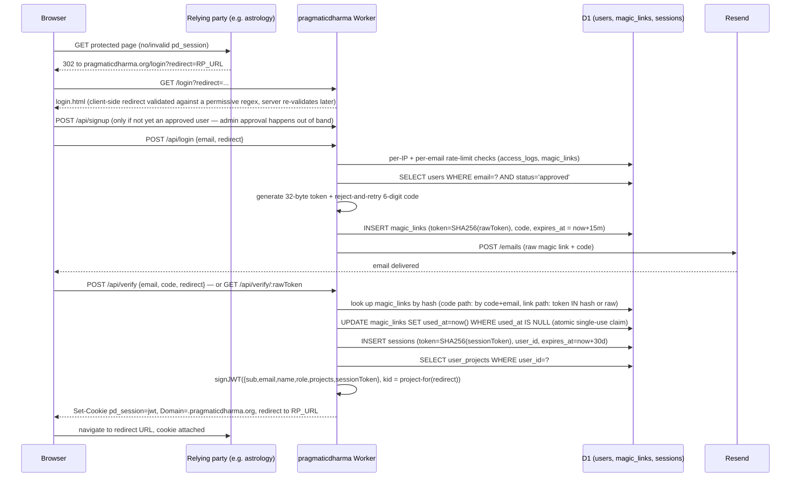
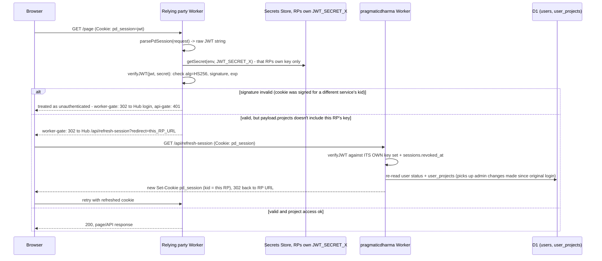

# Architecture

Operator reference for the `pragmaticdharma` repo — written to be read without an AI assistant on hand. It documents what's actually in the code as of 2026-07-17, not what any other project's notes assume about it.

## 1. What this is

`pragmaticdharma` is a single Cloudflare Worker (`worker.js`, no framework, no bundler) that serves the pragmaticdharma.org landing page, runs magic-link login + admin approval, and acts as the SSO hub for the rest of the pragmaticdharma.org family: it mints a shared `pd_session` HS256 JWT cookie (`Domain=.pragmaticdharma.org`, HttpOnly, Secure, SameSite=Lax, 30-day expiry) and holds a *per-service* signing key for every sub-project in Cloudflare Secrets Store, so a compromised sub-project's key only forges tokens for that one service. This is "Model A" hub SSO. The relying parties that use it are: `ego-assessment` (psychology.pragmaticdharma.org), `astrology`, `discern`, `mind-reader`, `shield`, `psychtools`, `practice`, `bromnichord`, `sentinel`, `review` — **and, contrary to a common assumption elsewhere in the fleet's notes, also `health.pragmaticdharma.org` (tcm-tracker)**. Health is fully wired into this hub: it's in `KNOWN_PROJECTS`, in the redirect allowlist, has its own `JWT_SECRET_HEALTH` signing key, and its Flask backend verifies that same JWT on every request. See §6(b) for the full trace. `psyche` (psyche.pragmaticdharma.org) is the one genuine exception — it is independent by design ("Model B"): its own D1, own auth, a host-only cookie, and it makes no requests to other pd hosts. It shares only the DNS zone and the Resend account with this platform.

## 2. Component map



Notes on the map:
- `schema.sql` in this repo only defines the seven auth/admin tables above. `sentinel-web` and `psychic-shield` write their own tables (`sentinel_*`, etc.) into the *same* D1 database (`pragmaticdharma`, id `d5bfd74e-5105-4136-a876-7d42e588d3d5`) — this repo doesn't own or migrate those tables, but a `wrangler d1 execute` against this DB touches them too.
- `retreats.pragmaticdharma.org` is served by this same Worker directly (`RETREATS_HTML`) — it isn't a separate relying party, it's just another route on this Worker.
- `/pd-sso.js` is a small client script hosted here and loaded by every sub-app; it detects "cookie present but signed with the wrong service's key" (arriving from a different sub-app) and silently re-mints the cookie via `/api/refresh-session`.

## 3. Sequence diagrams

### 3a. Magic-link / code login, end to end



### 3b. How a relying party validates `pd_session`



The canonical verifier that relying parties are supposed to use is `shared/auth-cloudflare.js` (Workers) / `shared/auth-flask.py` (Python, e.g. tcm-tracker). In practice each sub-project keeps its own copy rather than importing across repo boundaries (Cloudflare Workers don't share code across deployments), so the canonical file is a reference, not a live dependency — see §6 for what that implies for keeping them in sync.

**Important:** neither `shared/auth-cloudflare.js` nor `shared/auth-flask.py` calls back to the Hub to check `sessions.revoked_at`. A logout at the Hub revokes the Hub-side session row and stops the Hub's *own* checks from passing, but a relying party that already has a valid, unexpired JWT in a cookie will keep accepting it for up to 30 days — the Hub's revocation is not honored anywhere but the Hub itself. This is a known, documented gap (not something this pass introduced) — see §6.

## 4. Data

D1 database `pragmaticdharma` (id `d5bfd74e-5105-4136-a876-7d42e588d3d5`), schema in `schema.sql`. Retention below is enforced by `runRetentionSweep()` in `worker.js`, wired to the Worker's `scheduled()` handler and a `[triggers] crons = ["0 4 * * *"]` entry in `wrangler.toml` (04:00 UTC daily, chosen as the platform's quietest hour).

| Table | What's in it | Retention |
|---|---|---|
| `users` | email, name, status (`pending`/`approved`/`rejected`), role (`user`/`admin`), free-text `note` from signup, `preferences` JSON | No automatic purge — this is the durable identity table |
| `magic_links` | SHA-256 hash of the login token, 6-digit code, email, `user_id`, `expires_at` (15 min from creation), `used_at` (single-use claim) | Cron deletes rows where `created_at` is more than **1 day** old (links live 15 min; the extra day is a debugging grace window) |
| `verify_failures` | per-email failed-code counter (`count`, `first_at` epoch seconds) — powers the 5-strikes-per-15-min brute-force lockout on the code-verify path | Cron deletes rows where `first_at` is more than **1 day** old |
| `sessions` | SHA-256 hash of the session token (the raw value only ever lives inside the JWT cookie), `user_id`, `expires_at` (30 days), `revoked_at`, `ip_address`, `user_agent` | Cron deletes rows where `expires_at` is more than **7 days** in the past (i.e., sessions are kept until 7 days past their own natural expiry, then purged) |
| `access_logs` | every signup/login attempt and (per project) access event: `user_email`, `project`, `path`, `ip_address`, `country`/`city`/`region`/`isp` (Cloudflare geo), `user_agent` | Cron deletes rows where `created_at` is more than **90 days** old. This is the highest-PII table (email + IP + ISP + UA together) |
| `config` | key/value store — currently just `open_beta` and per-project `open_beta:<project>` flags | No purge (small, intentional config table) |
| `user_projects` | which project keys (`shield`, `health`, `astrology`, ...) each `user_id` is allowed into | No purge — this is live authorization state |

`access_logs` and `magic_links`/`sessions`/`verify_failures` purges all run inside the same `ctx.waitUntil(runRetentionSweep(env))` call every night; each step is a separate `DELETE` and logs its own row count via `console.log('[retention] ...')`, visible in `wrangler tail` output around 04:00 UTC.

## 5. Ops

**Deploy.** From the repo root:
```bash
npm run deploy      # = wrangler deploy
```
There's no staging environment — this deploys straight to `pragmaticdharma.org` and `retreats.pragmaticdharma.org` (the two routes in `wrangler.toml`). Before deploying anything that touches auth, run `npm test` (fast, local, no network — in-memory D1) and, if you have the JWT secrets exported, `node test-auth.js` (live integration test against all subdomains, 45 checks).

**Tail logs.**
```bash
npx wrangler tail pragmaticdharma
```
(`pragmaticdharma` is the Worker's `name` from `wrangler.toml`.) This shows every request plus the retention-sweep log lines around 04:00 UTC and any `console.error` from a handler exception (caught centrally in `fetch()` and returned as a generic 500).

**Query D1.** Either raw:
```bash
npx wrangler d1 execute pragmaticdharma --remote --command "SELECT email, status FROM users ORDER BY created_at DESC LIMIT 20;"
```
or through the bundled admin CLI, `./pd`, which wraps the same command with table-formatted output and a few canned operations:
```bash
./pd pending              # list pending signups
./pd approve EMAIL        # approve a user (also grants all KNOWN_PROJECTS)
./pd reject EMAIL         # reject a user
./pd users                # list all users
./pd beta on|off          # toggle global open-beta (auto-approve signups)
./pd logs [PROJECT] [N]   # recent access_logs
./pd config               # dump the config table
```
`./pd` escapes single quotes into the SQL it interpolates (wrangler's `d1 execute --command` doesn't support bound parameters from the shell), and every email/argument it accepts is validated against a basic email regex first.

**Secrets — names and locations only, no values here.** Everything lives in Cloudflare Secrets Store, store `pragmaticdharma` (id `626a023faf5e4be98729d2f4b9849f09`), except one legacy plain Worker secret:
- Per-service JWT signing keys, one per relying party: `JWT_SECRET_PRAGMATICDHARMA`, `JWT_SECRET_EGO_ASSESSMENT`, `JWT_SECRET_SHIELD`, `JWT_SECRET_MINDREADER`, `JWT_SECRET_PSYCHTOOLS`, `JWT_SECRET_ASTROLOGY`, `JWT_SECRET_PRACTICE`, `JWT_SECRET_HEALTH`, `JWT_SECRET_BROMNICHORD`, `JWT_SECRET_DISCERN`, `JWT_SECRET_REVIEW`. (`sentinel` currently reuses `JWT_SECRET_PRAGMATICDHARMA` — a documented temporary state, tracked in this repo's `TODO.md`.) This Worker's `wrangler.toml` binds *all* of them (it has to, to sign for any destination); each relying party's own `wrangler.toml` binds only its own.
- `RESEND_API_KEY` (Secrets Store entry name `PRAGMATICDHARMA_RESEND_API_KEY`) — outbound login/approval email via Resend.
- `DISCORD_WEBHOOK_URL` — still a plain `wrangler secret put` value on the `pragmaticdharma` Worker (not yet migrated to the Store; tracked in `TODO.md`), used for signup notifications and retention-sweep alerting.
- Code reads all of the above through the `getSecret(env, name)` helper at the top of `worker.js`, which transparently handles both a Secrets Store binding (`.get()` is async) and a plain string binding — never read `env.<SECRET>` directly.
- `compatibility_date` in `wrangler.toml` must stay at `2026-04-01` or later — older dates make Secrets Store bindings behave like Service Bindings and break `.get()`.

**What breaks if this Worker is down.**
- `pragmaticdharma.org` and `retreats.pragmaticdharma.org` go fully down (they're routed directly to this Worker) — landing page, signup, login, admin dashboard, `/health`, all of it.
- No new logins anywhere in the Model A family: every relying party's "not authenticated" path redirects here, and nothing can complete a magic-link/code login without this Worker to mint the JWT.
- `GET /api/refresh-session` breaks, so admin changes to a user's `projects` (granting/revoking access to a specific sub-app) stop taking effect until this Worker is back — existing JWTs keep whatever `projects` claim they were minted with.
- `/pd-sso.js` (loaded by every sub-app) can't reach `/api/refresh-session` either, so its cross-app cookie re-mint silently stops working; users who land on a second sub-app with a cookie signed for a different `kid` will just look logged out there until this Worker returns.
- Relying parties that already have a valid, unexpired `pd_session` cookie keep working fine — JWT verification is local (their own Secrets Store key), no callback to this Worker per request.
- `psyche.pragmaticdharma.org` is unaffected — it doesn't depend on this Worker at all (Model B).
- `health.pragmaticdharma.org` (tcm-tracker) behaves like any other relying party here: existing sessions keep validating locally against its own `JWT_SECRET_HEALTH`, but new logins and the admin dashboard's cross-fetches to it (`pages/admin.html` calls `health.pragmaticdharma.org/admin/api/*`) both break, the latter because the admin page itself is unreachable.

## 6. Improvement candidates

Read-only observations from this pass — nothing here was changed.

### (a) Does an old raw (pre-hash-at-rest) session cookie still validate?

**Yes, and it's not a bug — traced and confirmed by the test suite.** Sessions and magic links used to store the raw token as the D1 primary key; a deploy (`f2a6e56`, "Gap 2: hash session + magic-link tokens at rest") switched storage to `SHA-256(token)`. Every lookup site (`handleVerifyLink`, `verifyJWT`'s revocation check, `handleLogout`) now queries `WHERE token IN (?, ?)` binding both `SHA256(presented)` and the raw `presented` value:

```js
const session = await env.DB.prepare(
  'SELECT revoked_at FROM sessions WHERE token IN (?, ?)'
).bind(await sha256Hex(payload.sessionToken), payload.sessionToken).first();
```

For a session row created *before* the hash-at-rest deploy, the stored `token` column is still the raw value. The client's cookie/JWT still carries that same raw value (it never changes across a plain verify — `handleRefreshSession` explicitly preserves `sessionToken` across re-signs). So the second bind parameter (`payload.sessionToken`, unhashed) matches the old row directly. Both raw session tokens and SHA-256 hashes are 64 hex characters, so there's no format mismatch to trip over either. `test/token-hashing.test.mjs` has two tests that insert a raw (unhashed) row directly into the DB and confirm both that it verifies (`legacy raw session row still verifies and can be revoked`) and that logout can still revoke it — both pass (`npm test`, 13/13 green as of this read). Net: the fallback works as designed; pre-deploy sessions and magic links survive the migration with no data backfill needed, and will simply age out via the retention sweep (magic links after 1 day, sessions 7 days past their original 30-day expiry) since new rows are only ever written hashed.

### (b) What happens if someone completes login while "on" health.pragmaticdharma.org?

**The premise needs correcting: health.pragmaticdharma.org is a full relying party in this system, not an exception.** It's in `KNOWN_PROJECTS`, in `REDIRECT_ALLOWLIST`, in `redirectUrlToProject` (maps to project key `'health'`), and has its own `JWT_SECRET_HEALTH` entry in `KID_TO_BINDING` — the same four data structures every other sub-project (astrology, discern, etc.) is registered in. This repo's own `CLAUDE.md` sub-projects table lists it explicitly (`health.pragmaticdharma.org | tcm-tracker (Flask via cloudflared) | api-gate (401)`), and the sibling review (`reviews/2026-04-23-tcm-tracker.md`) confirms tcm-tracker verifies the same `pd_session` cookie and auto-provisions users on first SSO visit.

Tracing the actual flow: an unauthenticated visit to `health.pragmaticdharma.org` gets redirected (by tcm-tracker's own middleware) to `https://pragmaticdharma.org/login?redirect=https://health.pragmaticdharma.org/...`. `login.html` reads that `redirect` query param client-side (validated there against a permissive `*.pragmaticdharma.org` regex, `pages/login.html:73`) and forwards it in the `POST /api/login` and `POST /api/verify` bodies. Server-side, `validateRedirectUrl()` re-validates it against the authoritative `REDIRECT_ALLOWLIST` — `health.pragmaticdharma.org` is on that list, so the redirect survives. `kidForRedirect(redirect)` then resolves to `'health'`, so `signJWT` signs the cookie with `JWT_SECRET_HEALTH` specifically — the same key tcm-tracker's own verifier holds. The response is `{ redirect: 'https://health.pragmaticdharma.org/...' }` plus `Set-Cookie: pd_session=<jwt>`; the login page's JS does `window.location.href = res.data.redirect`, and the user lands back on health.pragmaticdharma.org fully authenticated — no different from landing back on astrology or discern. There is no special-casing anywhere in `worker.js` that treats `health` differently from any other relying party.

Whatever fleet-level note describes health as "not a relying party" is out of date relative to this code, or is talking about something narrower (e.g., health not sharing D1 tables with this Worker, which is true — tcm-tracker is Flask-on-biggie, not a Cloudflare Worker, and keeps its own data store; only the SSO cookie is shared). Worth reconciling wherever that note lives.

### Other findings

- **Dead code:** `getSigningKey(env)` (`worker.js`, ~line 1059) is defined and commented "Legacy helper retained only for callers that still expect a single key," but nothing in this file calls it — `signJWT`/`verifyJWT` always go through `getSigningKeyForKid`. Confirm no external caller depends on it (Workers don't share code across deployments, so this is unlikely) and remove it.
- **Likely-dead export surface:** `worker.js` ends with `export { verifyJWT, getJWTFromCookie, signJWT, accessEmbed, formatLocation, notifyDiscord }`. This repo's own `CLAUDE.md` and `docs/ai-development-guide.md` both note that "in practice each Worker has its own copy today (the import path doesn't ship across project boundaries)" — meaning no sibling repo can actually `import` this file at runtime (separate Cloudflare Worker deployments). Worth confirming nothing imports this module (e.g., a shared test harness) before treating the export list as intentional API surface versus leftover from an earlier single-deployment assumption.
- **Missing test coverage:** `npm test` (13 tests, all passing) covers the core auth path well — magic-link/code verification, atomic single-use claims, token hash-at-rest with legacy fallback, logout revocation, and the retention sweep. It does **not** cover `handleSignup` (per-IP/global rate limits, the 30-day rejected-user cooldown, open-beta auto-approval), `handleAdmin` (the CSRF Origin/Referer guard, approve/reject, the `config` key allowlist), `handleRefreshSession`, or `validateRedirectUrl`'s allowlist behavior directly. `test-auth.js` covers cross-service enforcement but is a live integration test requiring real JWT secrets — it isn't run as part of `npm test` / CI.
- **`GET /api/logout` performs a state change** (revokes the D1 session row) on a GET request — both `GET` and `POST` route to `handleLogout`. A GET that mutates state is fetchable via a bare ``/link prefetch/CSRF, so a third party can force a logout (low severity — the only effect is an unwanted logout, not data exposure — but easy to tighten to POST-only, unlike the admin routes which already have an Origin/Referer CSRF guard for non-GET methods).
- **`package.json` is missing `"type": "module"`**, which makes every `npm test` run print a `MODULE_TYPELESS_PACKAGE_JSON` Node warning ("Reparsing as ES module... incurs a performance overhead") for each test file. Harmless today, cheap to silence.
- **Revocation is hub-only (already documented, still open):** relying parties verify `pd_session` locally against their own key and never check the Hub's `sessions.revoked_at`. Logging out — or an admin rejecting a user — stops the Hub's own checks immediately but a relying party keeps honoring the old JWT until its 30-day expiry. This is a known, deliberate tradeoff pending an owner decision (short-lived JWTs + forced refresh, a revocation-check callback, or a shared denylist), not something introduced by this pass.
- **No bot protection on the Hub's own login form:** `handleLogin` has a per-IP (20/hour) and per-email (3/hour) throttle but no CAPTCHA/Turnstile, so an attacker with a botnet-scale IP pool can still burn the Resend send quota or brute-force-probe emails at low-and-slow rates per IP.
- **Four parallel data structures must be kept in sync by hand** when onboarding a new sub-project: `KNOWN_PROJECTS`, `REDIRECT_ALLOWLIST`, `redirectUrlToProject`, and `KID_TO_BINDING`. They're consistent today, but nothing enforces that consistency, and a missed entry in any one of them fails differently (e.g., missing from `REDIRECT_ALLOWLIST` silently drops the redirect back to `/` instead of erroring). `TODO.md` already tracks a v2 registry-driven rewrite meant to collapse this to one entry per project — this is why that item exists.
